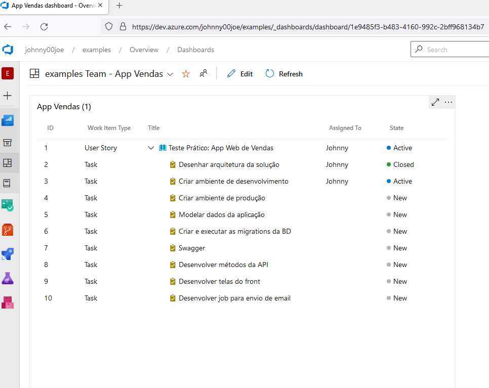
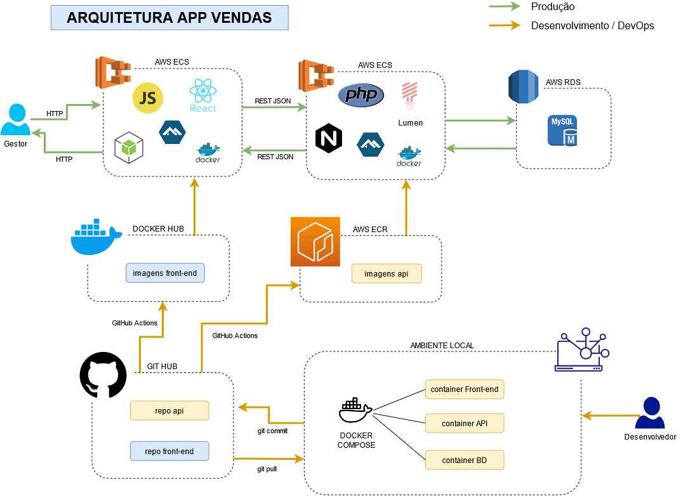

# Teste prático de desenvolvimento:
Desafio: Aplicativo web de vendas

# História de Usuário:
<a target="_blank" href="https://dev.azure.com/johnny00joe/examples/_workitems/edit/1">https://dev.azure.com/johnny00joe/examples/_workitems/edit/1</a>

# Tracking da história de usuário:
https://dev.azure.com/johnny00joe/examples/_dashboards/dashboard/1e9485f3-b483-4160-992c-2bff968134b7


# Arquitetura da Solução:


# Ambiente de Desenvolvimento:

  ```
  git clone https://github.com/johnny00joe/appvendas.git
  ```

  ```
  mkdir -p database database/data && cd database
  ```

  ```
  git clone https://github.com/johnny00joe/appvendas-database.git
  ```

  ```
  cd ../
  ```

  ```
  docker-compose up
  ```

  Front: http://localhost:3000
  
  API: http://localhost:8080

  BD: host="localhost"; port="3308"; user="appvendas"; password="1234"


# Repositórios relacionados:

- https://github.com/johnny00joe/appvendas
- https://github.com/johnny00joe/appvendas-backend
- https://github.com/johnny00joe/appvendas-database
- https://github.com/johnny00joe/appvendas-frontend


