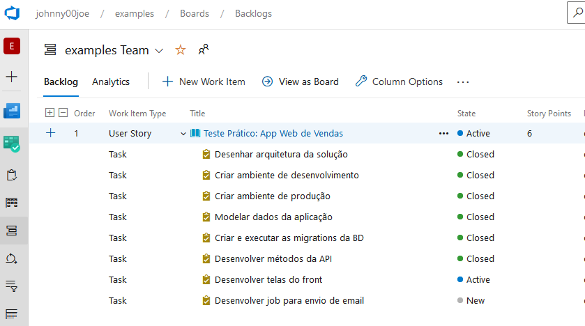

# Teste prático de engenharia de software

Este é um projeto para fins de aprendizagem, que serve como estudo de caso, exercícios e testes relacionados à engenharia de software, e surgiu do seguinte desafio proposto: desenvolver um aplicativo web de vendas e criar um ambiente de desenvolvimento e produção para este aplicativo.

# Tecnologias

PHP, Javascript, HTML, CSS, Ajax, Json, Lumen, ReactJS, Docker, Alpine, Nginx, GitHub Actions, AWS Cloud, Google Cloud Platform.

# Documentação do Projeto

<a target="_blank" href="https://dev.azure.com/johnny00joe/examples/_wiki/wikis/examples.wiki/1">https://dev.azure.com/johnny00joe/examples/_wiki/wikis/examples.wiki/1</a>

# Status

# Instalação

<a target="_blank" href="https://dev.azure.com/johnny00joe/examples/_wiki/wikis/examples.wiki/6/?anchor=instala%C3%A7%C3%A3o">https://dev.azure.com/johnny00joe/examples/_wiki/wikis/examples.wiki/6/?anchor=instala%C3%A7%C3%A3o</a>

# Repositórios

 - Ambiente de Desenvolvimento: https://github.com/johnny00joe/appvendas
 
 - Front-end: https://github.com/johnny00joe/appvendas-frontend

 - Back-end: https://github.com/johnny00joe/appvendas-backend

 - Base de Dados: https://github.com/johnny00joe/appvendas-database

# Últimas Releases

- Front-end:

  - **0.1:** https://github.com/johnny00joe/appvendas-frontend/releases/tag/v0.1
  
    Resolução parcial do desafio

    - Ambiente de Desenvolvimento
    - Ambiente de Produção

- Back-end:

  - **0.1:** https://github.com/johnny00joe/appvendas-backend/releases/tag/v.01

    Resolução parcial do desafio
  
    - Ambiente de Desenvolvimento
    - Ambiente de Produção
